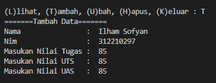
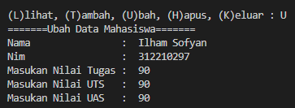
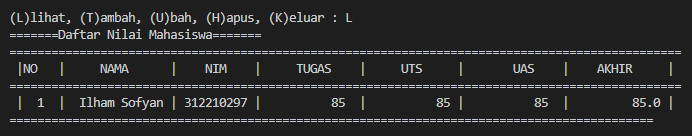
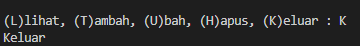

# UAS Bahasa Pemrograman Semester 1 Tahun 2022/2023
## Nama : Muhammad Ilham Sofyan Saifudin
## NIM  : 312210297
## Kelas: TI 22 A3

# Membuat Package dan Module
## **Adapun Soal Yang Diberikan Sebagai Berikut:**

## ***``daftar_nilai.py`` berisi :***
## ***tambah_data***
## ***Source Code***
```python
data = []
data = {}
print("PROGRAM MENAMPILKAN DAFTAR NILAI MAHASISWA")
while True:
    print("")
    c =input("(L)lihat, (T)ambah, (U)bah, (H)apus, (K)eluar : ")
    if c.lower() == 't':
        print("=======Tambah Data=======")
        nama = input("Nama                :  ")
        nim = input("Nim                 :  ")
        tugas = int(input("Masukan Nilai Tugas :  "))
        uts = int(input("Masukan Nilai UTS   :  "))
        uas = int(input("Masukan Nilai UAS   :  "))
        akhir = (0.30 * tugas) + (0.35 * uts) + (0.35 * uas)
        data[nama] = nim, tugas, uts, uas, akhir
```
    
## ***Output***


## ***Ubah_data***
## ***Source Code***
```python
elif c.lower() == 'u':
        print('=======Ubah Data Mahasiswa=======')
        nama = input('Nama                :  ')
        if nama in data.keys():
            nim = input('Nim                 :  ')
            tugas = int(input("Masukan Nilai Tugas :  "))
            uts = int(input("Masukan Nilai UTS   :  "))
            uas = int(input("Masukan Nilai UAS   :  "))
            akhir = (0.30 * tugas) + (0.35 * uts) + (0.35 * uas)
            data[nama] = nim, tugas, uts, uas, akhir
        else:
            print("Data Nilai Tidak Ada".format(nama))
```

## ***Output***


## ***Lihat_data***
## ***Source Code***
```python
elif c.lower() == 'l':
        print("=======Daftar Nilai Mahasiswa=======")
        print("===============================================================================================")
        print(" |NO   |     NAMA      |    NIM    |     TUGAS    |     UTS     |       UAS    |    AKHIR     | ")
        print("===============================================================================================")
        i = 0
        for x in data.items():
            i += 1
            print(
                " | {6:2}  |  {0:12s} | {1:9s} | {2:11}  | {3:11} | {4:11}  |  {5:11} |".format(x[0], x[1][0], x[1][1],
                                                                                                x[1][2], x[1][3],
                                                                                                x[1][4], i))
            print("============================================================================================")
```

## ***Output***


## ***Keluar Dan Hapus data***
## ***Source Code***
```python

    elif c.lower() == 'h':
        print("=======Hapus Data Mahasiswa=======")
        nama = input("Nama :  ")
        if nama in data.keys():
            del data[nama]
        else:
            print("Data Nilai Tidak Ada".format(nama))

    elif c.lower() == 'k':
        print("Keluar Dari Program")
        break
```

## ***Output***
